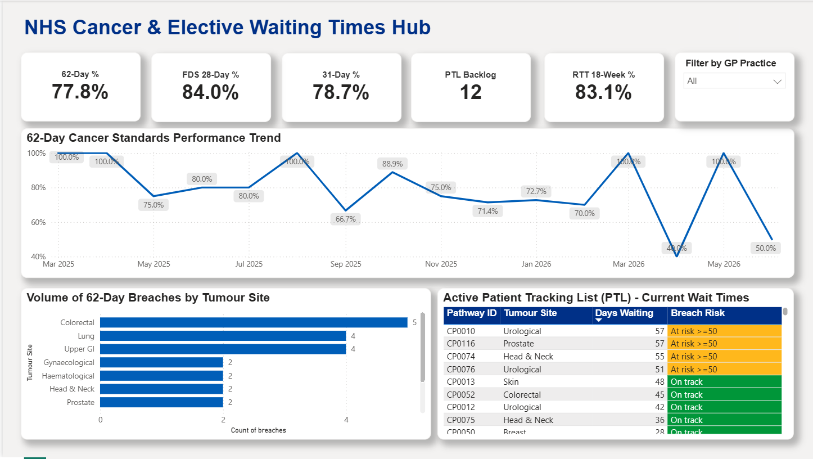

# NHS Cancer & Elective Waiting Times Hub

A SQL Server and Power BI project that models how an NHS acute trust monitors its **cancer** and **elective (RTT)** waiting times, flags breaches, and tracks the patients still waiting on a live Patient Tracking List (PTL).


> All data in this repository is synthetic and was generated for demonstration. It contains no real patient information.

---

## Dashboard preview



---

## What this project does

NHS trusts are measured against national waiting-time standards for cancer and planned care. The job of a reporting analyst is to turn raw pathway data into two things: a clear view of **how the trust is performing against those standards**, and a working list of **which patients are about to breach** so operational teams can act in time.

This project builds that end to end: the calculation logic sits in T-SQL (as it would on a real data warehouse), and Power BI sits on top to visualise performance and surface the PTL.

## Standards modelled

| Standard | What it measures | Target |
|---|---|---|
| Faster Diagnosis Standard (FDS) | Diagnosis or all-clear within **28 days** of referral | 80% |
| 31-day standard | Treatment within **31 days** of the decision to treat | 96% |
| 62-day standard | Treatment within **62 days** of referral | 85% |
| RTT 18-week | Elective treatment within **18 weeks (126 days)** of referral | 92% |

The RTT logic also handles **active monitoring**, where the clock stops while a patient is watched rather than treated, and restarts only if a later decision to treat is made.

## Skills demonstrated

**SQL (T-SQL)**
- `JOIN` across a patients dimension and the pathway tables
- `DATEDIFF` date logic to calculate waits and `CASE` to flag breaches
- Common Table Expressions (`WITH`) to keep complex queries readable
- Window functions: `RANK() OVER (...)` to rank the longest waiters on the PTL, and `LAG() OVER (...)` for month-on-month performance change
- Conditional aggregation (`SUM(CASE WHEN ...)`) for percentage-in-standard

**Power BI**
- Star-schema model: a `patients` dimension joined 1-to-many to `cancer_analysis` and `rtt_analysis`
- DAX measures for each headline standard
- KPI cards, trend line, breach-by-specialty breakdown, and a PTL table with conditional formatting (red for breached, amber for at-risk)

**Domain**
- Cancer waiting-time standards (FDS, 31-day, 62-day), RTT 18-week, clock starts and stops, breaches, and the Patient Tracking List

## Data architecture

```
Synthetic source tables  ->  T-SQL pipeline (calculation)  ->  analysis tables  ->  Power BI
   patients                    waits, breach flags,            cancer_analysis      model + DAX
   cancer_pathways             PTL, monthly trend              rtt_analysis         + visuals
   rtt_pathways
```

Calculation is done upstream in SQL so the Power BI model stays light, which mirrors how NHS analytics teams work against a SQL Server data warehouse.

## How to run it

**See the SQL run in 30 seconds (no setup):**
Open `NHS-Waiting-Times-Hub/2_SQL_Scripts/NHS_Waiting_Times_Pipeline.sql`, copy it into [SQL Fiddle](https://sqlfiddle.com) with **MS SQL Server** selected, and run. Each query returns its own result grid. (Tested and working there.)

**Open the dashboard:**
1. Clone the repository.
2. Open `NHS-Waiting-Times-Hub/3_PowerBI_Dashboard/NHS_Cancer_&_Elective_Waiting_Times_Hub.pbix` in Power BI Desktop.
3. If prompted, point the data source at the CSVs in `1_Data_Assets/` (or your own SQL Server) and click **Refresh**.

## Repository structure

```
NHS-Waiting-Times-Hub/
├── 1_Data_Assets/
│   ├── patients.csv
│   ├── cancer_pathways.csv
│   ├── rtt_pathways.csv
│   ├── cancer_analysis.csv
│   └── rtt_analysis.csv
├── 2_SQL_Scripts/
│   └── NHS_Waiting_Times_Pipeline.sql
├── 3_PowerBI_Dashboard/
│   └── NHS_Cancer_&_Elective_Waiting_Times_Hub.pbix
└── Images/
    └── dashboard_preview.png
```

## A note on governance

The data is fully synthetic and pseudonymised. In a real deployment, patient-level reporting like this would sit behind Row-Level Security and the trust's information governance controls.

---

**Author:** Hrishi Suresh · [LinkedIn](https://www.linkedin.com/in/hrishi-suresh-2970921a5/) · [GitHub](https://github.com/Hrishisuresh)
